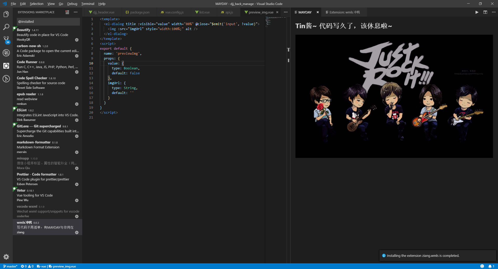

## MAYDAY鼓励师

在 VS Code 中连续写代码一小时（时间可配置），会有你设置的图片提醒你该休息啦~
本插件修改自超越鼓励师，可自定义图片，自定义昵称。

## 使用

除了每过一小时会自动弹出提醒页面，也可以按 `F1`, 然后输入 `wmls: 打开提醒页面`来打开提醒页面

## 配置

* `wmls.reminderViewIntervalInMinutes`: 展示提醒页面的时间间隔（分钟）。 (默认值为**60**)
* `wmls.photos`: 展示提醒页面的图片（数组形式），支持网络图片地址。 (必填)
* `wmls.nickName`: 展示提醒页面的昵称。 (默认值为**攻城狮**)
